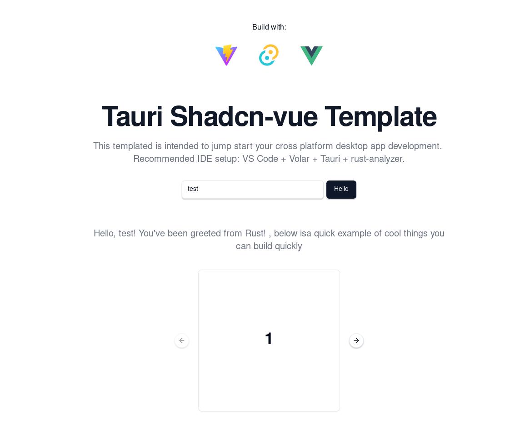

# Tauri Shadcn-vue Template

I love to tinker and build desktop apps for fun. I was building them using Electron until i discovered Tauri. I love Tauri and I just wanted to build a starter template that would allow someone to jump start their desktop app with evertyhing they could possible need complete their app. 

The back end is Build in Rust while the frontend is build with Html, Css, js/ts and Vue.




This template should help get you started developing with Vue 3 and TypeScript in Vite. The template uses Vue 3 `<script setup>` SFCs, check out the [script setup docs](https://v3.vuejs.org/api/sfc-script-setup.html#sfc-script-setup) to learn more.

## Recommended IDE Setup

- [VS Code](https://code.visualstudio.com/) + [Volar](https://marketplace.visualstudio.com/items?itemName=Vue.volar) + [Tauri](https://marketplace.visualstudio.com/items?itemName=tauri-apps.tauri-vscode) + [rust-analyzer](https://marketplace.visualstudio.com/items?itemName=rust-lang.rust-analyzer)

## Getting Started

Just Git Clone this repo then:
```Bash
$ cd tauri-shadcnvue-vite-template/
$ npm run tauri dev

#that it , you are ready to go!!

```
## Building

Follow [this guide](https://tauri.app/v1/guides/building/) to build for your target OS.

## Trust Minimise
If you do not want to install some random repo from the internet into your computer i have put a [step by step guide](Basic-Tauri-Shadcn-desktop-app.md) build your basic desktop app from all the revelant sources.

## Type Support For `.vue` Imports in TS

Since TypeScript cannot handle type information for `.vue` imports, they are shimmed to be a generic Vue component type by default. In most cases this is fine if you don't really care about component prop types outside of templates. However, if you wish to get actual prop types in `.vue` imports (for example to get props validation when using manual `h(...)` calls), you can enable Volar's Take Over mode by following these steps:

1. Run `Extensions: Show Built-in Extensions` from VS Code's command palette, look for `TypeScript and JavaScript Language Features`, then right click and select `Disable (Workspace)`. By default, Take Over mode will enable itself if the default TypeScript extension is disabled.
2. Reload the VS Code window by running `Developer: Reload Window` from the command palette.

You can learn more about Take Over mode [here](https://github.com/johnsoncodehk/volar/discussions/471).

## Acknowledgement 
This stands on the sholders countless FOSS projects. Thanks to the collective and individual contribution that has allowed me to make this.

#### Backend
 - [Rust](https://www.rust-lang.org/)
 - [Tauri](https://tauri.app/)
#### Front End
 - [Tailwind](https://tailwindcss.com/)
 - [Vue](https://vuejs.org/guide/typescript/overview.html)
 - [shadcn-vue.com](https://www.shadcn-vue.com/) This will supercharge your UI development
